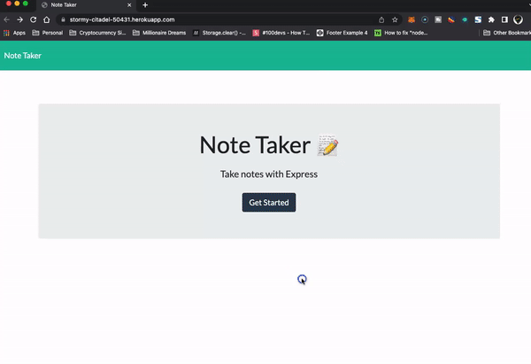

# Note Taker

### Description
This assignment was to modify starter code to create an application called Note Taker that can be used to write and save notes. This application will use an Express.js back end and will save and retrieve note data from a JSON file. The application’s front end was already created. It was required to build the back end, connect the two, and then deploy the entire application to Heroku.

### Screenshot

### Purpose of this app
Allow the user to write and save notes on our website

### Demo

### Heroku Link
https://note-taker-420.herokuapp.com/

### Contact
Feel free to reach out to me.
Github: https://github.com/RubenCastroCoding
Email: RubenCastroCoding@gmail.com
